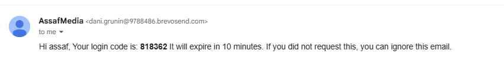
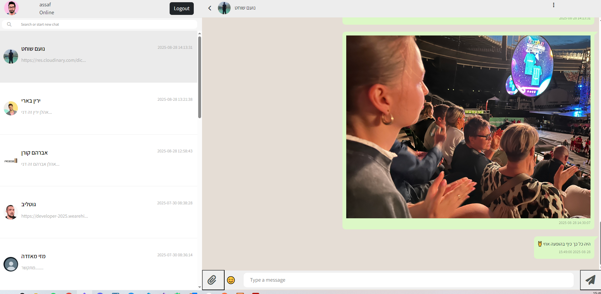
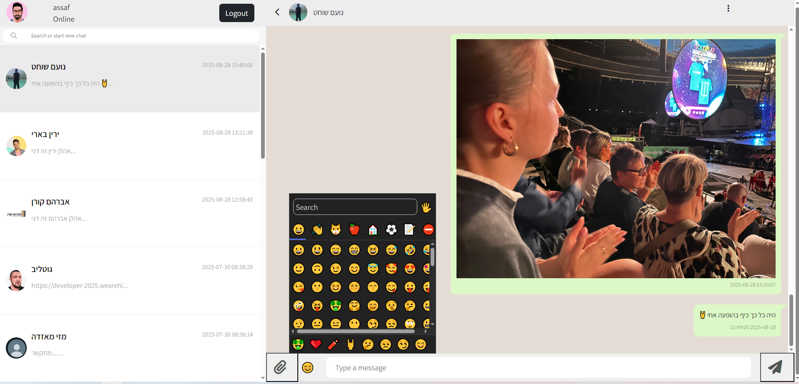

# Project Setup

<br>

## Step 1 – Create Configuration File

Created a `config.local.php` file to store **Brevo** API credentials and OTP policy settings.  
This file loads environment variables, sets OTP limits, handles logging, and provides helper functions for CORS and JSON responses.

<br>

## Step 2 – Initialize Frontend

Created a standalone React app using:

```bash
npx create-react-app client
cd client
```

## Step 3 – Install UI Dependencies

Installed Bootstrap for styling and React-Toastify for toast notifications:

```bash
npm install bootstrap@5.3.8
npm install react-toastify
```

## Step 4 – Create Login Page

Built a React login page that uses Bootstrap for styling and React-Toastify for notifications.
The page lets users enter a username and email, request an OTP from the backend, verify it, store the token in localStorage, and redirect to /index.php upon success.






<br>

## Step 5 – Database Schema Updates

The database structure was updated to support OTP authentication, API tokens, and better tracking of user data.

### Table: `config`

- No structural changes.
- Minor charset/collation updates.

### Table: `contacts`

- **New fields:**
  - `created_at` → tracks when the contact was added.
  - `updated_at` → auto-updates whenever the contact row changes.

### Table: `messages`

- **New field:**
  - `id` (bigint unsigned) → unique reference for messages.
- **New index:**
  - `idx_messages_user_time` on `(belongs_to_username, msg_datetime)` for faster queries.

### Table: `users`

- **New fields for authentication & session management:**
  - `email`
  - `otp_hash`
  - `otp_expires_at`
  - `otp_last_sent_at`
  - `otp_hourly_count`, `otp_hourly_reset_at`
  - `otp_daily_count`, `otp_daily_reset_at`
  - `otp_attempts`
  - `api_token`
  - `api_token_expires_at`
  - `last_login_at`

These additions enable OTP verification, rate limiting, token-based authentication, and last login tracking.

<br>

## Step 6 – Authentication Endpoints

Added new PHP files under the `/auth` folder to handle OTP authentication and session management:

- **request-otp.php** → Generates and sends an OTP via Brevo.
- **verify-otp.php** → Verifies OTP and issues an API token on success.
- **verify_token.php** → Validates the API token for protected routes.
- **logout.php** → Logs out the user by clearing the API token and expiring cookies.

These endpoints work together with the React client to provide a full OTP login and session flow.

<br>

## Step 7 – Cloudinary Integration

Installed the Cloudinary PHP SDK to handle media uploads and storage:

```bash
composer require cloudinary/cloudinary_php
```

## Step 8 – Chat Input Features

Enhanced the chatbox input with new UI/UX features:

- **File Upload** → Added a file upload button (`fa-paperclip`) connected to a hidden `<input type="file">` for selecting images.
- **Emoji Picker** → Integrated an emoji button to trigger an emoji selector for messages.
- **Honeypot Field** → Added a hidden input field to prevent spam/bot submissions.

These improvements make the chat form more interactive and secure.


